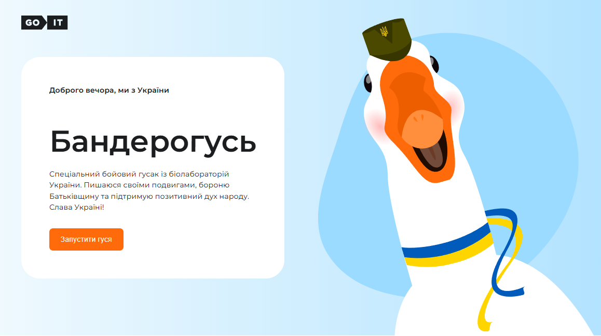

Banderogus - это мой первый учебный проект, который я проходил на ТЕСТ-драйве от GOIT, после чего я понял,что тема мне нравится.Тут так же использовано немного JAVA SCRIPT для воспроизведения анимации.

# Banderogus Website 🎨

Учебный проект: сайт-портфолио, выполненный по макету (desktop версия).

---

## 📸 Превью



---

## 🔗 Live Demo

[Смотреть сайт на GitHub Pages](https://bashmachok1982.github.io/Banderogus/)

---

## ✨ Особенности

- Верстка по макету (desktop)
- Использован flexbox для построения сеток
- Воспроизведение Анимации с использованием Java-Script
- Семантическая структура HTML

---

## 🛠 Технологии

- HTML5
- CSS3 (Flexbox)
- GitHub Pages (деплой)
- Java-Script

---

## 🚀 Запуск локально

1. Склонировать репозиторий:
   ```bash
   git clone git@github.com:Bashmachok1982/Banderogus.git
   ```
